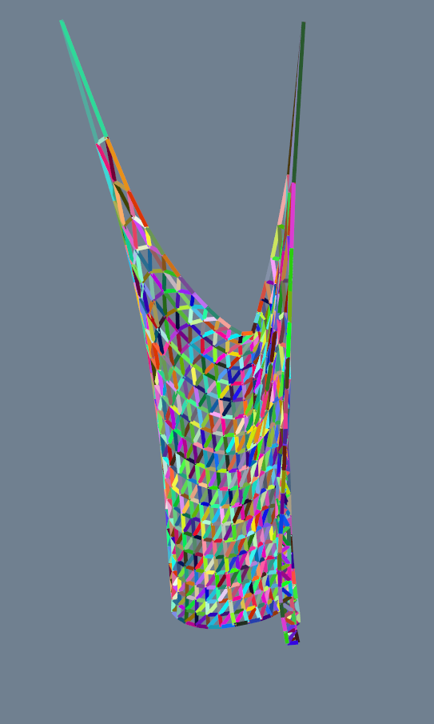
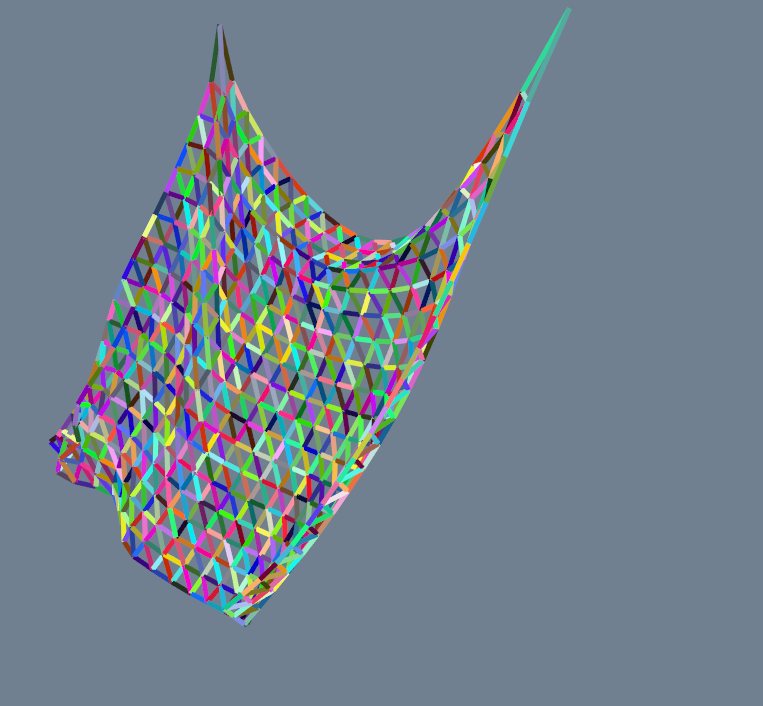

# Mass Spring Simulation
A simple demo for mass spring simulation. 

## Dependences

- Visualization Toolkit: https://vtk.org/
  - an open source software for manipulating  and displaying scientific data.
- Eigen: http://eigen.tuxfamily.org/index.php?title=Main_Page
  - a C++ template library for linear algebra: matrices, vectors, numerical solvers, and related algorithms.
- Cmake: https://cmake.org/
  - an open-source, cross-platform family of tools designed to build, test and package software.

## How to build it

- After u fix the dependences, u can use `cmake` to build a proper generator, such as `Unix Makefiles`、`MinGW Makefiles` and so on.

- If u use any linux operating system, u can simply use this shell script`build.sh` to build it.

  ```shell
  #!/bin/bash
  
  if [ $# -eq 0 ]; then
  	cmake . -Bbuild/debug -DCMAKE_BUILD_TYPE=Debug
  	if [ $? -eq 0 ]; then
  		cd build/debug
  		make
  	fi
  elif [ $# -eq 1 ]; then
      if [ $1 == "profile" ]; then
  	cmake . -Bbuild/debug -DCMAKE_BUILD_TYPE=Debug -DPROFILE_FLAG=1
  	if [ $? -eq 0 ]; then
  	    cd build/debug
  	    make
  	fi
      elif [ $1 == "release" ]; then
  	cmake . -Bbuild/release -DCMAKE_BUILD_TYPE=Release
  	if [ $? -eq 0 ]; then
  	    cd build/release
  	    make
  	fi
      else
  	echo "unknown argument"
      fi
  elif [ $# -eq 2 ]; then
      if [ $1 == "release" ]; then
  	if [ $2 == "profile" ]; then
  	    cmake . -Bbuild/release -DCMAKE_BUILD_TYPE=Release -DPROFILE_FLAG=1
  	    if [ $? -eq 0 ]; then
  		cd build/release
  		make
  	    fi
  	else
  	    echo "unknown argument"
  	fi
      else
  	echo "unknown argument"
      fi
  else
  	echo "build failed!"
  fi
  ```

  Yep, u should to specify a compile version, such `release` or `debug`. U just need to type

  ```shell
  ./build.sh release
  # or ./build.sh # to build a debug version
  ```

- If u have `gprof` and `gprof2dot` tools, u also can get a profile result by running `profile.sh`.

## Running Results

### Assemble Springs

- U can simply change the `main.cxx` file to re-assemble the mass spring system by your self.

- Also, U can implement a simple code to realize a function to read a obj file to generate a vertex matrix and face matrix. And then U can assemble the system by a obj file.

  > the igl::readOBJ is a private library. So it's not proper to expose it.

### Screenshots







